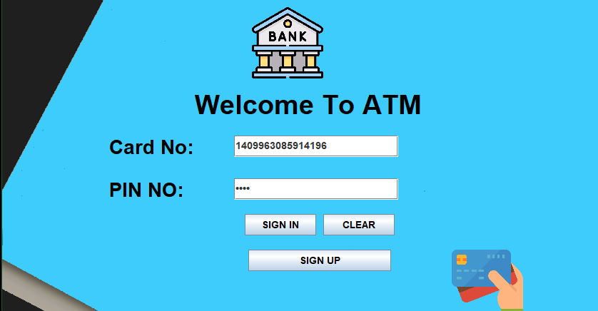
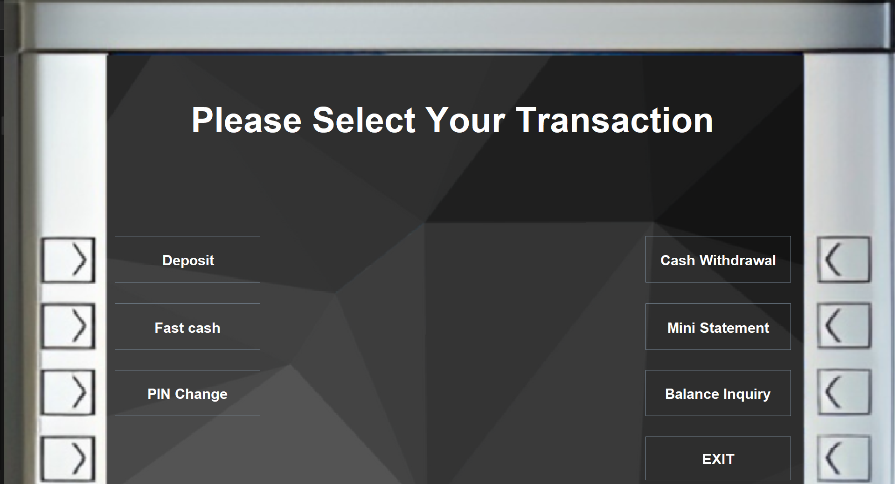
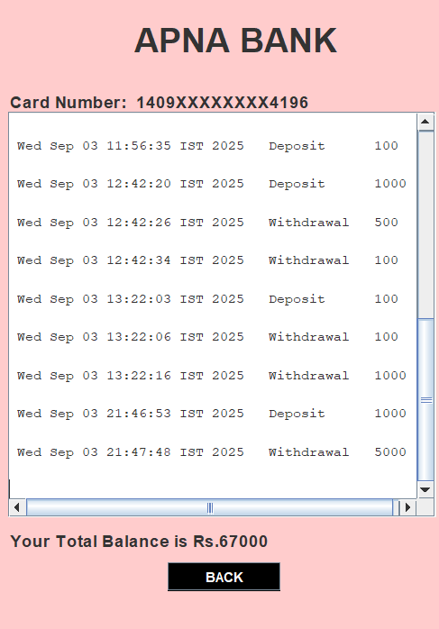
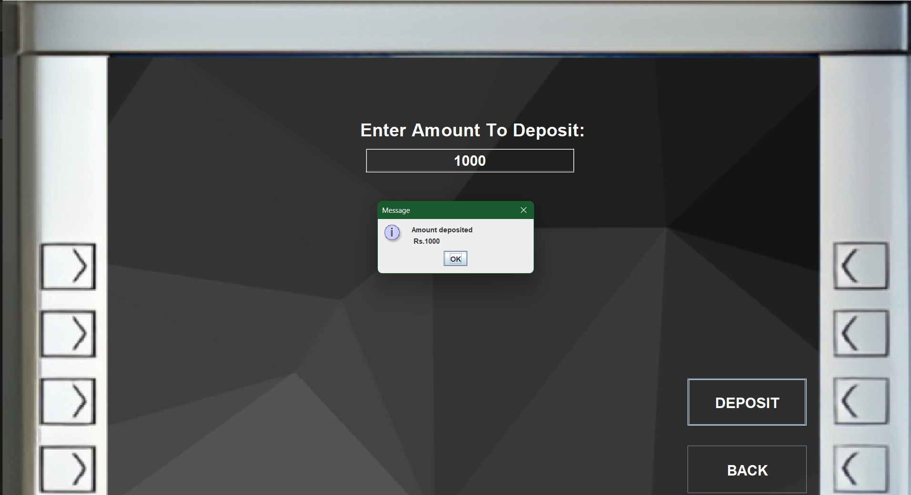
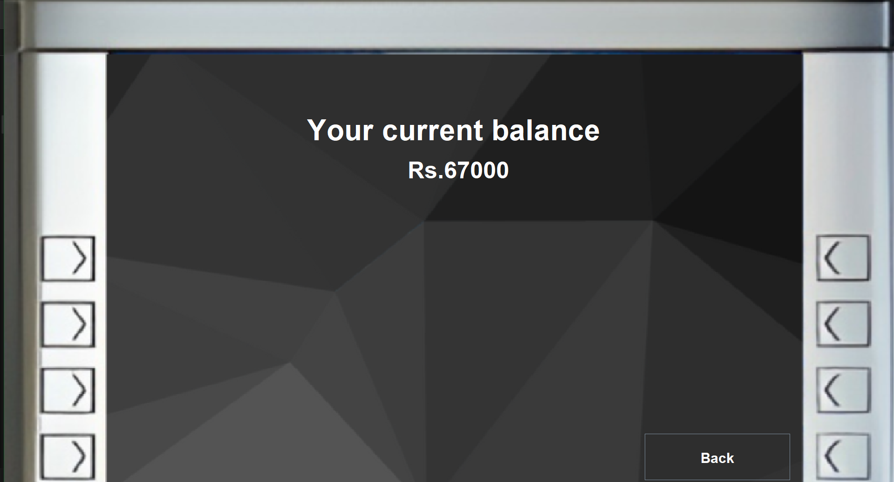
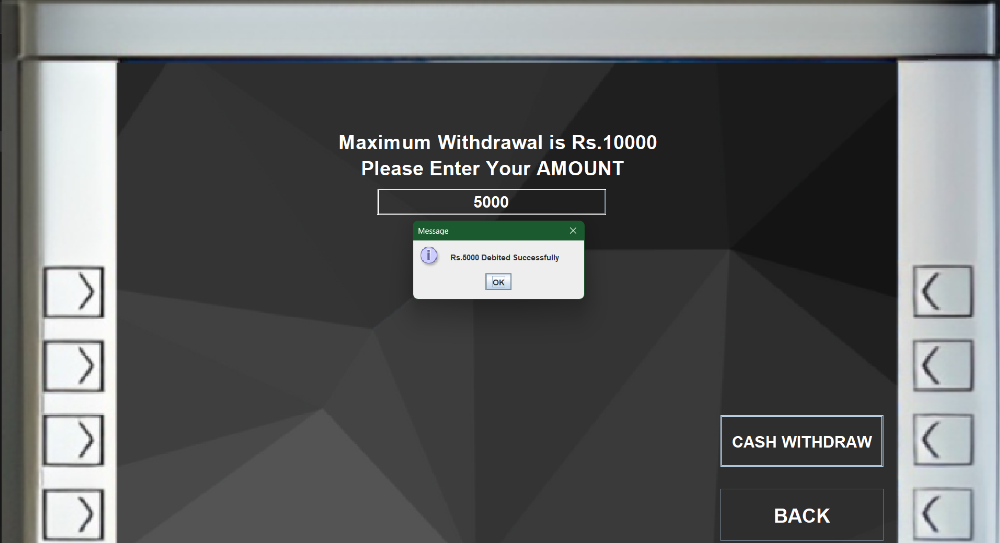

# 🏦 Bank Management System

An interactive Java Swing ATM simulator for user authentication, transactions, statement, and account management using a MySQL backend.

## 📸 Application Preview

### Login Screen


### Main Transaction Menu


### Mini Statement Display


### Deposit Confirmation


### Balance Inquiry


### Cash Withdraw Window



## 🚀 Features

- User Registration & Login (Card No & PIN)
- Deposit, Withdrawal, Fast Cash
- Mini Statement & Balance Inquiry
- PIN Change & graphical ATM simulation

## 📈 Example Transaction Table

| Date & Time                | Type        | Amount |
|----------------------------|-------------|--------|
| Wed Sep 03 11:56:35 IST    | Deposit     | 100    |
| Wed Sep 03 12:42:20 IST    | Deposit     | 1000   |
| Wed Sep 03 12:42:26 IST    | Withdrawal  | 500    |
| Wed Sep 03 12:42:34 IST    | Withdrawal  | 100    |
| Wed Sep 03 13:22:03 IST    | Deposit     | 100    |
| Wed Sep 03 13:22:06 IST    | Withdrawal  | 1000   |
| Wed Sep 03 21:46:53 IST    | Deposit     | 1000   |
| Wed Sep 03 21:47:48 IST    | Withdrawal  | 5000   |

## ⚙️ How to Run

1. **Install Java and MySQL.**
   - Ensure both Java and MySQL are properly installed on your system.

2. **Configure Database Connection.**
   - Open `Conn.java`.
   - Update it with your correct MySQL database name, username, and password.
   - Add additonal Jar files (mysql-connector-java and jcalender-tz) into your external libraries

3. **Prepare Resources.**
   - Place all screenshot images in the top-level project folder, alongside your `README.md` and source files.
   - Place any required icons referenced by the code into an `icon/` subfolder.

4. **Compile the Source Code.**
   - Launch a terminal or command prompt in the project folder.
   - Run the following to compile all files:
     ```
     javac *.java
     ```

5. **Start the Application.**
   - Run the application:
     ```
     java Login
     ```
   - Click the **SIGN UP** button on the login screen.
   - Fill out the multi-step signup forms to create your account and receive your card number and PIN.

6. **Sign In and Use the Application.**
   - Enter your card number and PIN to log in.
   - Access the main transaction menu to deposit, withdraw, check balance, change your PIN, get a mini statement, or exit.

7. **Enjoy!**
   - Explore all banking features with your new account.


## 🧑‍💻 License

MIT
